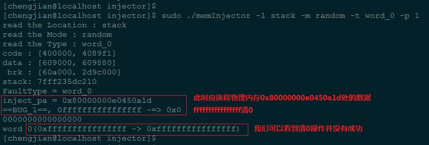
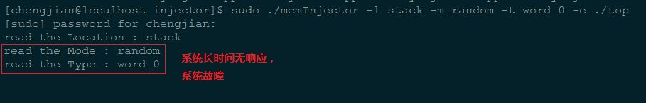

MemoryFaultInjection
=======


#配置安装
-------

##目录结构
-------

```cpp
|-- LICENSE
|-- README.md
|-- src                       ====   源代码目录
|   |-- bugs        bug目录   ====   记录程序的所有bug
|   |-- engine      驱动      ====   为应用程序和工具提供服务
|   |-- injector    应用程序 ====   故障注入工具的源码
|   `-- tools       工具包   ====   实现的外部接口命令
`-- workspace                 ====   测试目录
```

| 目录 | 描述 | Creator | Contributiors |
|:----:|:----:|:-------:|:-------------:|
| injector | qianjun(钱军老师) | qianjun, fenggang, gatieme |
| engine   | gatieme           | gatieme |
| tools    | gatieme           | fenggang, gatieme |


##构建过程
-------


在src目录下进行make后，会依次进入
进入engine, injector, tools目录完成驱动, 应用程序和工具包的构建

###构建驱动
-------

进入engine目录构建驱动              
目标驱动memoryEngine.ko

安装驱动程序
insmod memeoryEngine.ko
会在/proc/memoryEngine/目录目录下创建如下设备文件
ctl  kFuncName  memVal  physicalAddr  pid  signal  taskInfo  virtualAddr


###构建应用程序
-------

进入injector目录下构建应用程序      
应用程序memoryInject

Usage:
    ./memInjector -c fault.conf -e program [arguments]
    ./memInjector -c fault.conf -p pid

Arguments:
    1.  fault description scripts.
    2.  workload, workload can be a executable program or a running process ID.


###构建工具包
-------

进入tools目录下构建命令工具接口     
工具集合如下
getpinfo -=>    获取某个进程的信息
readpa   -=>    读取物理地址
writepa  -=>    对某个物理地址进行写操作
v2p      -=>    将逻辑地址转换为物理地址

##使用说明
-------

##地址选项
-------

系统进程代码段(BUG)
系统进程数据段
系统进程栈段
用户进程代码段(BUG)
用户进程数据段
用户进程栈段

##虚拟地址
-------

随机random
**其他方式未实现**


##故障注入类型
-------
one_bit_0       一位置0
one_bit_1       一位置1
one_bit_flip    一位反转
word_0          word清0
page_0          一页清

#编译问题
-------

##内核目录问题
-------
编译驱动使用了uname -r来获取内核头文件的地址
如果linux系统升过级请，自动为内核头文件建立链接
sudo ln -s 2.6.32-573.18.1.el6.x86_64 2.6.32-504.el6.x86_64


#BUG描述
-------

##bug-001
-------

**编号** ： bug-001

**描述** ： 地址空间修改失败

**详细信息**

执行sudo ./memInjector -l stack -m random -t word_0 -p 1
将进程1的栈区域某块地址随机清0的时候失败



**问题定位**

未知

##bug-002
-------

**编号** ： bug-001

**描述** ： -e指定加载可执行程序时, execv传入参数的问题

**详细信息**

执行sudo ./memInjector -l stack -m random -t word_0 -e ls -al
执行运行"ls -al"程序，对该程序栈区域某块地址随机清0的时候execv失败



问题定位：
系统执行"ls -al"的方式是通过fork子进程, 然后execv来执行的
但是execv接收两个参数, 1--可执行程序路径, 2--可执行程序的参数
我们的问题就在于第2个参数传入的程序运行参数有问题


##bug-003
-------
编号：bug-003
描述：SIGSEG
详细信息：

```shell
workspace/hello 
sudo ./memInjector -l stack -m random -t word_0 -p `pidof hello`
```
出现SIGSEGV

