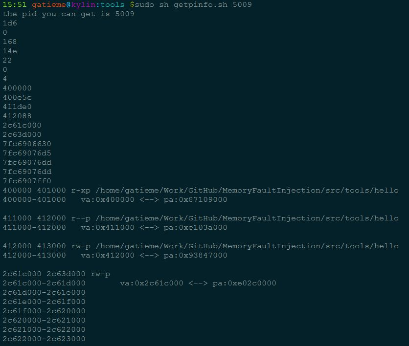

|  可执行程序 | 源代码 | 脚本 | 描述 |
| ------------- |:-------------:| -----:| -----:|
| hello | hello.c | 无 | 测试的hello world程序
| getpinfo | getTaskInfo.cpp |  getpinfo.sh | 获取进程的task结构信息 |
| 

#hello world程序
-------


#获取进程的pcb信息
-------

##说明
-------

|  可执行程序 | 源代码 | 脚本 | 描述 |
| ------------- |:-------------:| -----:| -----:|
| getpinfo | getTaskInfo.cpp |  getpinfo.sh | 获取进程的task结构信息 |

其实其本质是执行了如下信息

##执行操作
-------

```c
# 写入将要读取的进程pid
echo pid > /proc/memoryEngine/pid

#  写入控制标识REQUEST_GETTASKINFO = 1
echo 1 > /proc/memoryEngine/ctl

# 读取信号量, 信号量为1时说明读入完成, 否则则等待

cat /proc/memoryEngine/signal
# 读取进程的task信息

cat /proc/memoryEngine/taskInfo
```

##执行
-------

**二进制文件执行**

-p执行进程号, 获取进程号为pid的进程信息
`
``c
./getpinfo -p pid
```

-e指定可执行程序, 我们将通过execve加载可执行程序, 并读取其信息
```c
./getpinfo -e ./hello
```

**脚本执行**
```c
sh getpinfo.sh pid
```

##执行结果




